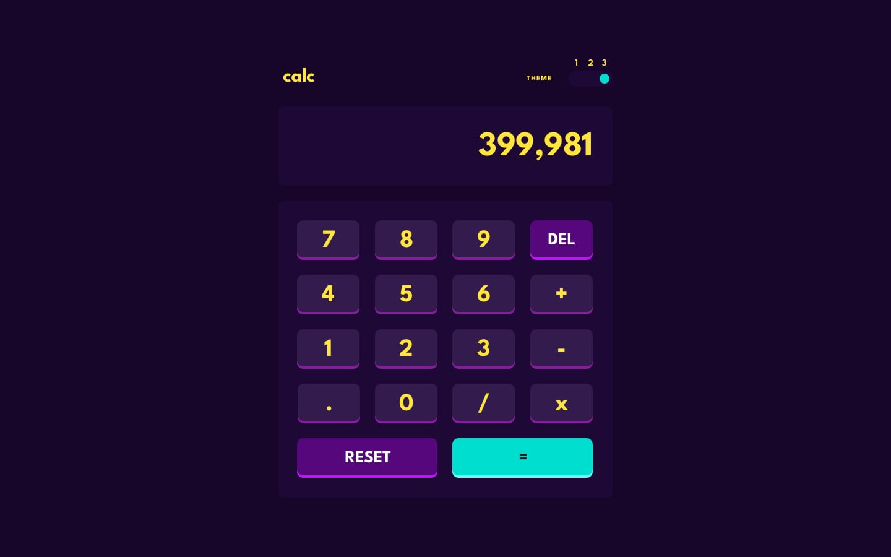

# Angular Calculator Application

This is a fully functional, responsive calculator web application built with modern Angular 19. The project features a clean, modern user interface with three switchable color themes and is structured using the latest Angular features like Standalone Components and Signals for state management. It serves as a practical example of building a modern frontend application with a clear separation of concerns, reusable components, and an injectable service for logic.

---

## ✨ Live Demo on Vercel ✨

[Live Demo]()

---

## Figma Design

[Figma Link](https://www.figma.com/file/wlEKgsOB7Y9rOT957Elroy/calculator-app?t=sC3BNYhAqHheCO6Z-0)

## Screenshots

The application includes three professionally designed themes to suit different user preferences.

- **Theme 1:** A dark, modern blue theme.
- **Theme 2:** A clean, light theme.
- **Theme 3:** A vibrant, high-contrast purple theme.

---

## Features

- **Standard Calculator Operations:** Performs addition, subtraction, multiplication, and division.
- **Three Switchable Themes:** Users can easily switch between three color themes using a toggle switch.
- **Responsive Design:** The layout is fully responsive and optimized for a seamless experience on various devices, including desktops, tablets, and mobile phones.
- **Clean & Modern UI:** The user interface is designed to be intuitive and visually appealing, inspired by the Frontend Mentor challenge.
- **State Management with Signals & Services:** Logic is cleanly separated from the UI using Angular's reactive Signals and an injectable service, making the code modular, testable, and maintainable.
- **Dynamic Theming:** Theming is handled efficiently using CSS Custom Properties (Variables), allowing for instant theme changes.

---

## Built With

This project leverages modern web development technologies to create a fast and robust application.

-- **Angular 19:** The core frontend framework used for building the user interface with modern features like Standalone Components and Signals.

-- **TypeScript:** A statically typed superset of JavaScript that enhances code quality and maintainability.

-- **Angular CLI:** The command-line interface for Angular, used for project setup, development, and build processes.

-- **CSS Custom Properties:** Used for implementing the dynamic theming system.
